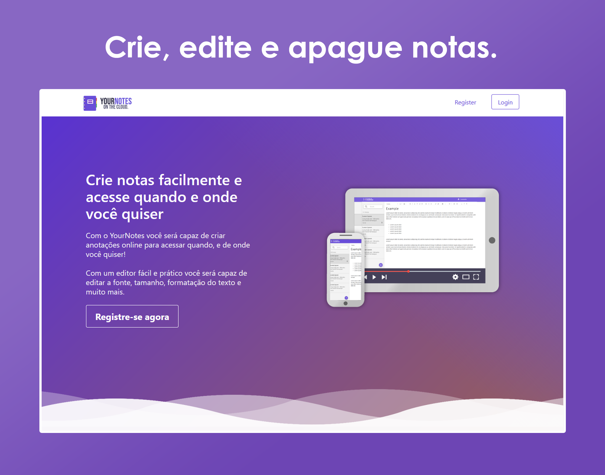
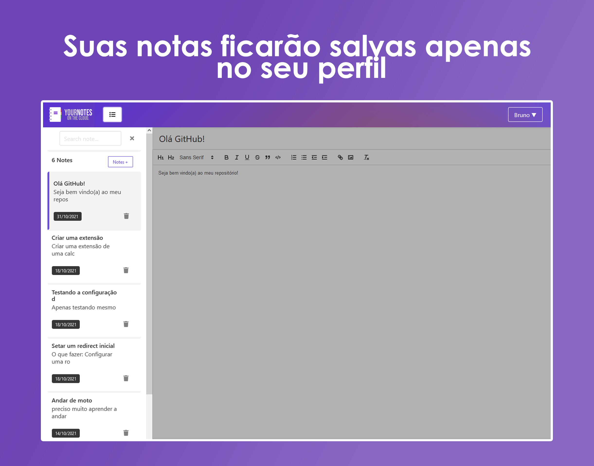
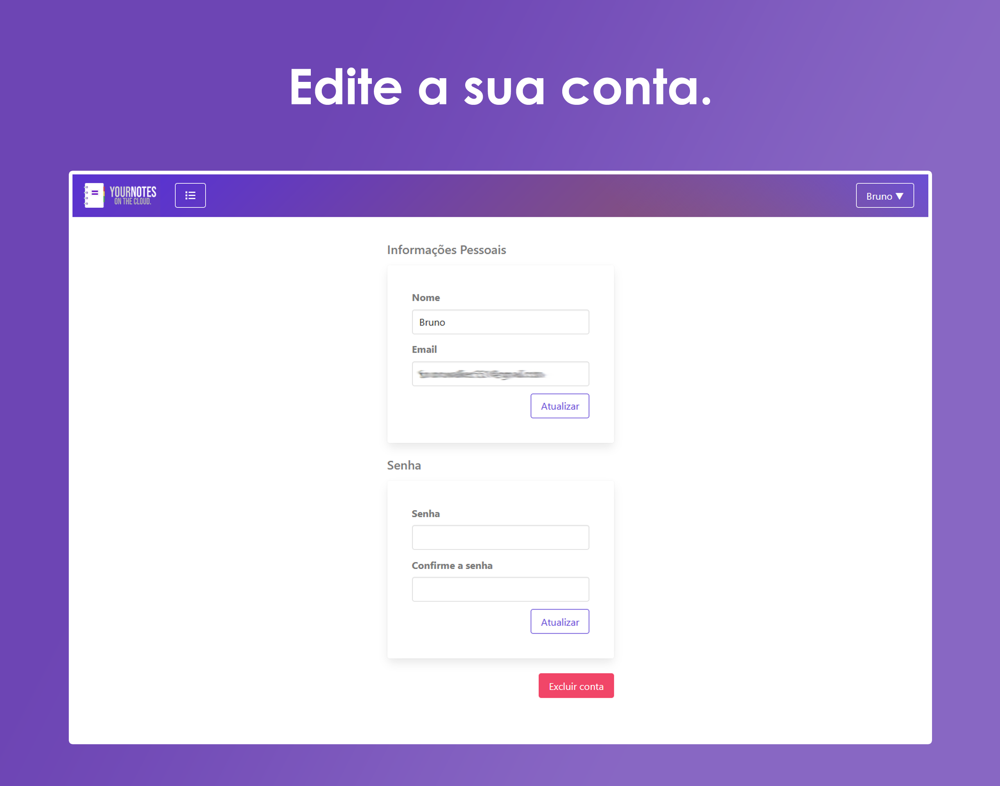

<div align="center">
  
</div>

<h1 align="center">
    
</h1>


## 💻 Sobre o projeto

<strong>YourNotes</strong> é um gerenciador de notas, um organizador de ideias, textos ou até lembretes para desenvolvimento pessoal. 
Inspirado em aplicações como Evernote ou Microsoft OneNote.

Por enquanto só está disponível a versão desktop sem responsividade pra mobile.

<br>

<h1 align="center">
    
</h1>

<h1 align="center">
    
</h1>

<br>

## 🧪 Tecnologias usadas

Esse projeto foi desenvolvido com as seguintes tecnologias:

- [React](https://reactjs.org)
- [SCSS](https://sass-lang.com/)
- [MongoDB](https://www.mongodb.com/)
- [JavaScript](https://www.javascript.com/)

## 🔗  Clone a aplicação

Clone o projeto e acesse a pasta do mesmo.

```bash
$ git clone https://github.com/brunofilho1/javascript-notes-client/
$ cd javascript-notes-client
```
## 🚀 Como iniciar a aplicação

Para iniciá-lo, siga os passos abaixo:
```bash
# Instalar as dependências
$ yarn
# Iniciar o projeto
$ yarn start
```
O app estará disponível no seu browser pelo http://localhost:3000 assim que iniciado.

Mas lembre-se de também iniciar a [API](https://github.com/brunofilho1/javascript-notes-api) para conseguir realizar ações no site, como criar sua conta 
e usar o editor de notas.

<h1 align="center">
    
</h1>

## 🌐 Live preview
<a target="_blank" href="">Veja o site online clicando aqui.</a>

## 📝 Licença MIT

Esse projeto está sob a licença MIT. Veja o arquivo [LICENSE](LICENSE) para mais detalhes.

---
